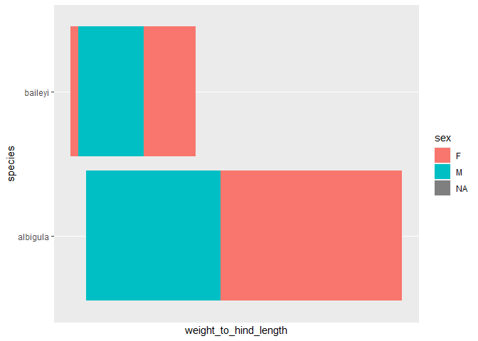

## Instructions
Answer the following questions and complete the exercises in RMarkdown. Please embed all of your code and push your final work to your repository. Your final lab report should be organized, clean, and run free from errors. Remember, you must remove the `#` for the included code chunks to run. Be sure to add your name to the author header above. For any included plots, make sure they are clearly labeled. You are free to use any plot type that you feel best communicates the results of your analysis.  

Make sure to use the formatting conventions of RMarkdown to make your report neat and clean!  

## Load the libraries

```r
library(tidyverse)
library(janitor)
library(here)
library(naniar)
library(dplyr)
```

## Desert Ecology
For this assignment, we are going to use a modified data set on [desert ecology](http://esapubs.org/archive/ecol/E090/118/). The data are from: S. K. Morgan Ernest, Thomas J. Valone, and James H. Brown. 2009. Long-term monitoring and experimental manipulation of a Chihuahuan Desert ecosystem near Portal, Arizona, USA. Ecology 90:1708.

```r
deserts <- readr::read_csv("data/surveys_complete.csv")
```

```
## Rows: 34786 Columns: 13
## ── Column specification ────────────────────────────────────────────────────────
## Delimiter: ","
## chr (6): species_id, sex, genus, species, taxa, plot_type
## dbl (7): record_id, month, day, year, plot_id, hindfoot_length, weight
## 
## ℹ Use `spec()` to retrieve the full column specification for this data.
## ℹ Specify the column types or set `show_col_types = FALSE` to quiet this message.
```

1. Use the function(s) of your choice to get an idea of its structure, including how NA's are treated. Are the data tidy?  

```r
glimpse(deserts)
```

```
## Rows: 34,786
## Columns: 13
## $ record_id       <dbl> 1, 2, 3, 4, 5, 6, 7, 8, 9, 10, 11, 12, 13, 14, 15, 16,…
## $ month           <dbl> 7, 7, 7, 7, 7, 7, 7, 7, 7, 7, 7, 7, 7, 7, 7, 7, 7, 7, …
## $ day             <dbl> 16, 16, 16, 16, 16, 16, 16, 16, 16, 16, 16, 16, 16, 16…
## $ year            <dbl> 1977, 1977, 1977, 1977, 1977, 1977, 1977, 1977, 1977, …
## $ plot_id         <dbl> 2, 3, 2, 7, 3, 1, 2, 1, 1, 6, 5, 7, 3, 8, 6, 4, 3, 2, …
## $ species_id      <chr> "NL", "NL", "DM", "DM", "DM", "PF", "PE", "DM", "DM", …
## $ sex             <chr> "M", "M", "F", "M", "M", "M", "F", "M", "F", "F", "F",…
## $ hindfoot_length <dbl> 32, 33, 37, 36, 35, 14, NA, 37, 34, 20, 53, 38, 35, NA…
## $ weight          <dbl> NA, NA, NA, NA, NA, NA, NA, NA, NA, NA, NA, NA, NA, NA…
## $ genus           <chr> "Neotoma", "Neotoma", "Dipodomys", "Dipodomys", "Dipod…
## $ species         <chr> "albigula", "albigula", "merriami", "merriami", "merri…
## $ taxa            <chr> "Rodent", "Rodent", "Rodent", "Rodent", "Rodent", "Rod…
## $ plot_type       <chr> "Control", "Long-term Krat Exclosure", "Control", "Rod…
```

```r
naniar::any_na(deserts)
```

```
## [1] TRUE
```

2. How many genera and species are represented in the data? What are the total number of observations? Which species is most/ least frequently sampled in the study?


```r
deserts %>% count(species)
```

```
## # A tibble: 40 × 2
##    species             n
##    <chr>           <int>
##  1 albigula         1252
##  2 audubonii          75
##  3 baileyi          2891
##  4 bilineata         303
##  5 brunneicapillus    50
##  6 chlorurus          39
##  7 clarki              1
##  8 eremicus         1299
##  9 flavus           1597
## 10 fulvescens         75
## # … with 30 more rows
```


```r
deserts %>% 
  count(species) %>% 
  arrange(desc(n)) %>% 
  summarise(total_observations=sum(n))
```

```
## # A tibble: 1 × 1
##   total_observations
##                <int>
## 1              34786
```

```r
deserts %>% 
  count(species) %>% 
  arrange(desc(n)) %>% filter(n==1)
```

```
## # A tibble: 6 × 2
##   species          n
##   <chr>        <int>
## 1 clarki           1
## 2 scutalatus       1
## 3 tereticaudus     1
## 4 tigris           1
## 5 uniparens        1
## 6 viridis          1
```

```r
#These are least represented.
```


```r
deserts %>% 
  count(species) %>% 
  arrange(desc(n)) %>% head(n=1)
```

```
## # A tibble: 1 × 2
##   species      n
##   <chr>    <int>
## 1 merriami 10596
```

```r
#Merriami is the most frequently represented.
```
3. What is the proportion of taxa included in this study? Show a table and plot that reflects this count.

```r
deserts %>% 
  count(taxa) %>% ggplot(aes(x=taxa,y=n))+geom_col()+scale_y_log10()
```

<!-- -->


4. For the taxa included in the study, use the fill option to show the proportion of individuals sampled by `plot_type.`

```r
deserts %>% 
  ggplot(aes(x=taxa,fill=plot_type))+geom_bar()+scale_y_log10()
```

<!-- -->


5. What is the range of weight for each species included in the study? Remove any observations of weight that are NA so they do not show up in the plot.

```r
deserts %>% 
  group_by(species) %>% 
  ggplot(aes(x=species,y=weight),na.rm=T)+geom_boxplot()+coord_flip()
```

```
## Warning: Removed 2503 rows containing non-finite values (`stat_boxplot()`).
```

<!-- -->

6. Add another layer to your answer from #4 using `geom_point` to get an idea of how many measurements were taken for each species.

```r
deserts %>% 
  ggplot(aes(x=taxa,fill=plot_type))+geom_bar()+scale_y_log10()#not sure how to add that
```

<!-- -->


7. [Dipodomys merriami](https://en.wikipedia.org/wiki/Merriam's_kangaroo_rat) is the most frequently sampled animal in the study. How have the number of observations of this species changed over the years included in the study?


```r
deserts %>% 
  filter(species=="merriami") %>% 
  count(year) %>% 
  ggplot(aes(x=year,y=n))+geom_col()
```

<!-- -->


8. What is the relationship between `weight` and `hindfoot` length? Consider whether or not over plotting is an issue.

```r
deserts %>% 
  ggplot(aes(x=weight,y=hindfoot_length))+geom_jitter()+geom_smooth()
```

```
## `geom_smooth()` using method = 'gam' and formula = 'y ~ s(x, bs = "cs")'
```

```
## Warning: Removed 4048 rows containing non-finite values (`stat_smooth()`).
```

```
## Warning: Removed 4048 rows containing missing values (`geom_point()`).
```

<!-- -->
9. Which two species have, on average, the highest weight? Once you have identified them, make a new column that is a ratio of `weight` to `hindfoot_length`. Make a plot that shows the range of this new ratio and fill by sex.


```r
deserts %>% 
  group_by(species) %>% 
  summarise(mean_species_weight=mean(weight,na.rm=T)) %>% 
  head(n=3) 
```

```
## # A tibble: 3 × 2
##   species   mean_species_weight
##   <chr>                   <dbl>
## 1 albigula                159. 
## 2 audubonii               NaN  
## 3 baileyi                  31.7
```

```r
deserts %>% 
  mutate(weight_to_hind_length=weight/hindfoot_length) %>% 
  ggplot(aes(x=species,y=weight_to_hind_length,fill=sex),na.rm=T)+geom_col()+coord_flip()+scale_y_log10()
```

```
## Warning: Removed 4048 rows containing missing values (`position_stack()`).
```

<!-- -->

```r
deserts %>% 
  mutate(weight_to_hind_length=weight/hindfoot_length) %>% 
  filter(species=="albigula"|species=="baileyi") %>% 
  ggplot(aes(x=species,y=weight_to_hind_length,fill=sex),na.rm=T)+geom_col()+coord_flip()+scale_y_log10()
```

```
## Warning: Removed 289 rows containing missing values (`position_stack()`).
```

<!-- -->

```r
#only for 2 species with largest average weight:
```


10. Make one plot of your choice! Make sure to include at least two of the aesthetics options you have learned.


```r
deserts %>% 
  ggplot(aes(x = genus, fill = hindfoot_length)) + geom_bar(position = "dodge") +
  coord_flip() +
  labs(title = "Observations by Taxon in Deserts Data",
       x = "Genus",
       fill = "Hindfoot Length")+scale_y_log10()
```

```
## Warning: The following aesthetics were dropped during statistical transformation: fill
## ℹ This can happen when ggplot fails to infer the correct grouping structure in
##   the data.
## ℹ Did you forget to specify a `group` aesthetic or to convert a numerical
##   variable into a factor?
```

<!-- -->

## Push your final code to GitHub!
Please be sure that you check the `keep md` file in the knit preferences. 
