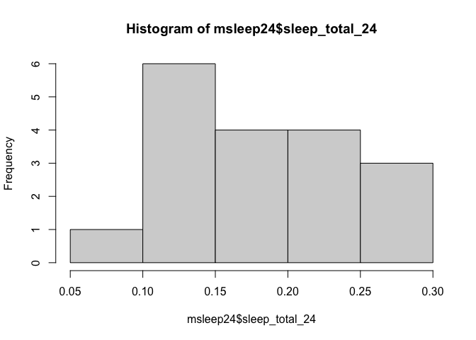

## Learning Goals
*At the end of this exercise, you will be able to:*    
1. Use a combination of `select()`, `filter()`, and `mutate()` to transform data frames.  
2. Use the `skimr` package to produce summaries of data.  
3. Produce clean summaries of data using `summarize()`.  
4. Use `group_by()` in combination with `summarize()` to produce grouped summaries of data.  

## Review
At this point, you should be comfortable using the functions of `dplyr`. If you need extra help, please [email me](mailto: jmledford@ucdavis.edu).  

## Load the tidyverse and janitor

```r
library("tidyverse")
library("janitor")
```

## Install `skimr`

```r
#install.packages("skimr")
library("skimr")
```

## Load the data
For this lab, we will use the built-in data on mammal sleep patterns. From: _V. M. Savage and G. B. West. A quantitative, theoretical framework for understanding mammalian sleep. Proceedings of the National Academy of Sciences, 104 (3):1051-1056, 2007_.

```r
msleep
```

```
## # A tibble: 83 × 11
##    name         genus vore  order conse…¹ sleep…² sleep…³ sleep…⁴ awake  brainwt
##    <chr>        <chr> <chr> <chr> <chr>     <dbl>   <dbl>   <dbl> <dbl>    <dbl>
##  1 Cheetah      Acin… carni Carn… lc         12.1    NA    NA      11.9 NA      
##  2 Owl monkey   Aotus omni  Prim… <NA>       17       1.8  NA       7    0.0155 
##  3 Mountain be… Aplo… herbi Rode… nt         14.4     2.4  NA       9.6 NA      
##  4 Greater sho… Blar… omni  Sori… lc         14.9     2.3   0.133   9.1  0.00029
##  5 Cow          Bos   herbi Arti… domest…     4       0.7   0.667  20    0.423  
##  6 Three-toed … Brad… herbi Pilo… <NA>       14.4     2.2   0.767   9.6 NA      
##  7 Northern fu… Call… carni Carn… vu          8.7     1.4   0.383  15.3 NA      
##  8 Vesper mouse Calo… <NA>  Rode… <NA>        7      NA    NA      17   NA      
##  9 Dog          Canis carni Carn… domest…    10.1     2.9   0.333  13.9  0.07   
## 10 Roe deer     Capr… herbi Arti… lc          3      NA    NA      21    0.0982 
## # … with 73 more rows, 1 more variable: bodywt <dbl>, and abbreviated variable
## #   names ¹​conservation, ²​sleep_total, ³​sleep_rem, ⁴​sleep_cycle
```

```r
names(msleep)
```

```
##  [1] "name"         "genus"        "vore"         "order"        "conservation"
##  [6] "sleep_total"  "sleep_rem"    "sleep_cycle"  "awake"        "brainwt"     
## [11] "bodywt"
```

We will also use the awesome [palmerpenguins](https://allisonhorst.github.io/palmerpenguins/articles/intro.html) data in the second part of lab.

```r
library("palmerpenguins")
palmerpenguins::penguins_raw
```

```
## # A tibble: 344 × 17
##    studyName Sample Num…¹ Species Region Island Stage Indiv…² Clutc…³ `Date Egg`
##    <chr>            <dbl> <chr>   <chr>  <chr>  <chr> <chr>   <chr>   <date>    
##  1 PAL0708              1 Adelie… Anvers Torge… Adul… N1A1    Yes     2007-11-11
##  2 PAL0708              2 Adelie… Anvers Torge… Adul… N1A2    Yes     2007-11-11
##  3 PAL0708              3 Adelie… Anvers Torge… Adul… N2A1    Yes     2007-11-16
##  4 PAL0708              4 Adelie… Anvers Torge… Adul… N2A2    Yes     2007-11-16
##  5 PAL0708              5 Adelie… Anvers Torge… Adul… N3A1    Yes     2007-11-16
##  6 PAL0708              6 Adelie… Anvers Torge… Adul… N3A2    Yes     2007-11-16
##  7 PAL0708              7 Adelie… Anvers Torge… Adul… N4A1    No      2007-11-15
##  8 PAL0708              8 Adelie… Anvers Torge… Adul… N4A2    No      2007-11-15
##  9 PAL0708              9 Adelie… Anvers Torge… Adul… N5A1    Yes     2007-11-09
## 10 PAL0708             10 Adelie… Anvers Torge… Adul… N5A2    Yes     2007-11-09
## # … with 334 more rows, 8 more variables: `Culmen Length (mm)` <dbl>,
## #   `Culmen Depth (mm)` <dbl>, `Flipper Length (mm)` <dbl>,
## #   `Body Mass (g)` <dbl>, Sex <chr>, `Delta 15 N (o/oo)` <dbl>,
## #   `Delta 13 C (o/oo)` <dbl>, Comments <chr>, and abbreviated variable names
## #   ¹​`Sample Number`, ²​`Individual ID`, ³​`Clutch Completion`
```

## dplyr Practice
Let's do a bit more practice to make sure that we understand `select()`, `filter()`, and `mutate()`. Start by building a new data frame `msleep24` from the `msleep` data that: contains the `name` and `vore` variables along with a new column called `sleep_total_24` which is the amount of time a species sleeps expressed as a proportion of a 24-hour day. Remove any rows with NA's and restrict the `sleep_total_24` values to less than 0.3. Arrange the output in descending order.  

```r
msleep24<-msleep %>% 
  mutate(sleep_total_24 = sleep_total/24) %>% 
  select(name,vore,sleep_total_24) %>% 
  filter(!is.na(vore)) %>% #removing NAs from a single variable
  filter(sleep_total_24<=0.3) %>% 
  arrange(desc(sleep_total_24))
```

Did `dplyr` do what we expected? How do we check our output? Remember, just because your code runs it doesn't mean that it did what you intended.

```r
summary(msleep24)
```

```
##      name               vore           sleep_total_24   
##  Length:18          Length:18          Min.   :0.07917  
##  Class :character   Class :character   1st Qu.:0.13125  
##  Mode  :character   Mode  :character   Median :0.16458  
##                                        Mean   :0.17755  
##                                        3rd Qu.:0.22083  
##                                        Max.   :0.26250
```

Try out the new function `skim()` as part of the `skimr` package.

```r
skim(msleep24)
```


Table: Data summary

|                         |         |
|:------------------------|:--------|
|Name                     |msleep24 |
|Number of rows           |18       |
|Number of columns        |3        |
|_______________________  |         |
|Column type frequency:   |         |
|character                |2        |
|numeric                  |1        |
|________________________ |         |
|Group variables          |None     |


**Variable type: character**

|skim_variable | n_missing| complete_rate| min| max| empty| n_unique| whitespace|
|:-------------|---------:|-------------:|---:|---:|-----:|--------:|----------:|
|name          |         0|             1|   3|  20|     0|       18|          0|
|vore          |         0|             1|   5|   5|     0|        2|          0|


**Variable type: numeric**

|skim_variable  | n_missing| complete_rate| mean|   sd|   p0|  p25|  p50|  p75| p100|hist  |
|:--------------|---------:|-------------:|----:|----:|----:|----:|----:|----:|----:|:-----|
|sleep_total_24 |         0|             1| 0.18| 0.06| 0.08| 0.13| 0.16| 0.22| 0.26|▃▇▆▅▆ |

Histograms are also a quick way to check the output.

```r
hist(msleep24$sleep_total_24)
```

<!-- -->

Don't forget we can also use `tabyl()` across one or many variables.

```r
msleep24 %>% 
  tabyl(vore) %>% 
  adorn_pct_formatting(digits=1)
```

```
##   vore  n percent
##  carni  6   33.3%
##  herbi 12   66.7%
```

## Practice
1. Which taxonomic orders have species that belong to more than one class of `vore`?


## `summarize()`
`summarize()` will produce summary statistics for a given variable in a data frame. For example, if you are asked to calculate the mean of `sleep_total` for large and small mammals you could do this using a combination of commands, but it isn't very efficient or clean. We can do better!  

```r
head(msleep)
```

```
## # A tibble: 6 × 11
##   name  genus vore  order conse…¹ sleep…² sleep…³ sleep…⁴ awake  brainwt  bodywt
##   <chr> <chr> <chr> <chr> <chr>     <dbl>   <dbl>   <dbl> <dbl>    <dbl>   <dbl>
## 1 Chee… Acin… carni Carn… lc         12.1    NA    NA      11.9 NA        50    
## 2 Owl … Aotus omni  Prim… <NA>       17       1.8  NA       7    0.0155    0.48 
## 3 Moun… Aplo… herbi Rode… nt         14.4     2.4  NA       9.6 NA         1.35 
## 4 Grea… Blar… omni  Sori… lc         14.9     2.3   0.133   9.1  0.00029   0.019
## 5 Cow   Bos   herbi Arti… domest…     4       0.7   0.667  20    0.423   600    
## 6 Thre… Brad… herbi Pilo… <NA>       14.4     2.2   0.767   9.6 NA         3.85 
## # … with abbreviated variable names ¹​conservation, ²​sleep_total, ³​sleep_rem,
## #   ⁴​sleep_cycle
```

For example, if we define "large" as having a `bodywt` greater than 200 then we get the following:

```r
large <- 
  msleep %>% 
  select(name, genus, bodywt, sleep_total) %>% 
  filter(bodywt > 200) %>% 
  arrange(desc(bodywt))
large
```

```
## # A tibble: 7 × 4
##   name             genus         bodywt sleep_total
##   <chr>            <chr>          <dbl>       <dbl>
## 1 African elephant Loxodonta      6654          3.3
## 2 Asian elephant   Elephas        2547          3.9
## 3 Giraffe          Giraffa         900.         1.9
## 4 Pilot whale      Globicephalus   800          2.7
## 5 Cow              Bos             600          4  
## 6 Horse            Equus           521          2.9
## 7 Brazilian tapir  Tapirus         208.         4.4
```


```r
mean(large$sleep_total)
```

```
## [1] 3.3
```

We can accomplish the same task using the `summarize()` function to make things cleaner.

```r
msleep %>% 
  filter(bodywt > 200) %>% #large mammals
  summarize(mean_sleep_lg = mean(sleep_total))
```

```
## # A tibble: 1 × 1
##   mean_sleep_lg
##           <dbl>
## 1           3.3
```

You can also combine functions to make useful summaries for multiple variables.

```r
msleep %>% 
    filter(bodywt > 200) %>% 
    summarize(mean_sleep_lg = mean(sleep_total), 
              min_sleep_lg = min(sleep_total),
              max_sleep_lg = max(sleep_total),
              total = n())
```

```
## # A tibble: 1 × 4
##   mean_sleep_lg min_sleep_lg max_sleep_lg total
##           <dbl>        <dbl>        <dbl> <int>
## 1           3.3          1.9          4.4     7
```

## Practice
1. What is the mean, min, and max `bodywt` for the taxonomic order Primates? Provide the total number of observations.

```r
msleep %>% 
  filter(order=="Primates") %>% 
  summarise(mean_bodywt=mean(bodywt),
           min_bodywt=min(bodywt),
           max_bodywt=max(bodywt),
           sd_bodywt=sd(bodywt),
           total=n())
```

```
## # A tibble: 1 × 5
##   mean_bodywt min_bodywt max_bodywt sd_bodywt total
##         <dbl>      <dbl>      <dbl>     <dbl> <int>
## 1        13.9        0.2         62      21.5    12
```

`n_distinct()` is a very handy way of cleanly presenting the number of distinct observations. Here we show the number of distinct genera over 100 in body weight.

```r
msleep %>% 
  filter(bodywt > 100) %>% 
  summarise(n_genera=n_distinct(genus))
```

```
## # A tibble: 1 × 1
##   n_genera
##      <int>
## 1        9
```

```r
#There are 9 genera with body weight over 100.
```
There are many other useful summary statistics, depending on your needs: sd(), min(), max(), median(), sum(), n() (returns the length of a column), first() (returns first value in a column), last() (returns last value in a column) and n_distinct() (number of distinct values in a column).

## Practice
1. How many genera are represented in the msleep data frame?

```r
msleep %>% 
  summarise(n_genera=n_distinct(genus))
```

```
## # A tibble: 1 × 1
##   n_genera
##      <int>
## 1       77
```

```r
#There are 77 genera espresented in msleep.
```

2. What are the min, max, and mean `sleep_total` for all of the mammals? Be sure to include the total n.

```r
msleep %>% 
  summarize(mean_sleep_lg=mean(sleep_total),
            min_sleep_lg=min(sleep_total),
            sd_sleep_lg=sd(sleep_total),
            max_sleep_lg=mean(sleep_total),
            total=n())
```

```
## # A tibble: 1 × 5
##   mean_sleep_lg min_sleep_lg sd_sleep_lg max_sleep_lg total
##           <dbl>        <dbl>       <dbl>        <dbl> <int>
## 1          10.4          1.9        4.45         10.4    83
```
## `group_by()`
The `summarize()` function is most useful when used in conjunction with `group_by()`. Although producing a summary of body weight for all of the mammals in the data set is helpful, what if we were interested in body weight by feeding ecology?

```r
msleep %>%
  group_by(vore) %>% #we are grouping by feeding ecology, a categorical variable
  summarize(min_bodywt = min(bodywt),
            max_bodywt = max(bodywt),
            mean_bodywt = mean(bodywt),
            total=n())
```

```
## # A tibble: 5 × 5
##   vore    min_bodywt max_bodywt mean_bodywt total
##   <chr>        <dbl>      <dbl>       <dbl> <int>
## 1 carni        0.028      800        90.8      19
## 2 herbi        0.022     6654       367.       32
## 3 insecti      0.01        60        12.9       5
## 4 omni         0.005       86.2      12.7      20
## 5 <NA>         0.021        3.6       0.858     7
```

## Practice
1. Calculate mean brain weight by taxonomic order in the msleep data.

```r
msleep %>% 
  group_by(order) %>%
  summarize(mean_brainwt=mean(brainwt))
```

```
## # A tibble: 19 × 2
##    order           mean_brainwt
##    <chr>                  <dbl>
##  1 Afrosoricida        0.0026  
##  2 Artiodactyla       NA       
##  3 Carnivora          NA       
##  4 Cetacea            NA       
##  5 Chiroptera          0.000275
##  6 Cingulata           0.0459  
##  7 Didelphimorphia    NA       
##  8 Diprotodontia      NA       
##  9 Erinaceomorpha      0.00295 
## 10 Hyracoidea          0.0152  
## 11 Lagomorpha          0.0121  
## 12 Monotremata         0.025   
## 13 Perissodactyla      0.414   
## 14 Pilosa             NA       
## 15 Primates           NA       
## 16 Proboscidea         5.16    
## 17 Rodentia           NA       
## 18 Scandentia          0.0025  
## 19 Soricomorpha        0.000592
```

2. What does `NA` mean? How are NA's being treated by the summarize function?

```r
msleep %>% 
  filter(order=="Carnivora") %>% 
  select(order,genus,brainwt)
```

```
## # A tibble: 12 × 3
##    order     genus        brainwt
##    <chr>     <chr>          <dbl>
##  1 Carnivora Acinonyx     NA     
##  2 Carnivora Callorhinus  NA     
##  3 Carnivora Canis         0.07  
##  4 Carnivora Felis         0.0256
##  5 Carnivora Haliochoerus  0.325 
##  6 Carnivora Panthera     NA     
##  7 Carnivora Panthera      0.157 
##  8 Carnivora Panthera     NA     
##  9 Carnivora Phoca        NA     
## 10 Carnivora Genetta       0.0175
## 11 Carnivora Vulpes        0.0445
## 12 Carnivora Vulpes        0.0504
```

```r
#NAs are being treated as strings. NA means there is no value assigned for a specific interaction between variables. 
```

3. Try running the code again, but this time add `na.rm=TRUE`. What is the problem with Cetacea? Compare this to Carnivora. 

```r
msleep %>% 
  group_by(order) %>%
  summarize(mean_brainwt=mean(brainwt,na.rm=T))
```

```
## # A tibble: 19 × 2
##    order           mean_brainwt
##    <chr>                  <dbl>
##  1 Afrosoricida        0.0026  
##  2 Artiodactyla        0.198   
##  3 Carnivora           0.0986  
##  4 Cetacea           NaN       
##  5 Chiroptera          0.000275
##  6 Cingulata           0.0459  
##  7 Didelphimorphia     0.0063  
##  8 Diprotodontia       0.0114  
##  9 Erinaceomorpha      0.00295 
## 10 Hyracoidea          0.0152  
## 11 Lagomorpha          0.0121  
## 12 Monotremata         0.025   
## 13 Perissodactyla      0.414   
## 14 Pilosa            NaN       
## 15 Primates            0.254   
## 16 Proboscidea         5.16    
## 17 Rodentia            0.00357 
## 18 Scandentia          0.0025  
## 19 Soricomorpha        0.000592
```


## That's it! Let's take a break and then move on to part 2! 

-->[Home](https://jmledford3115.github.io/datascibiol/)  
